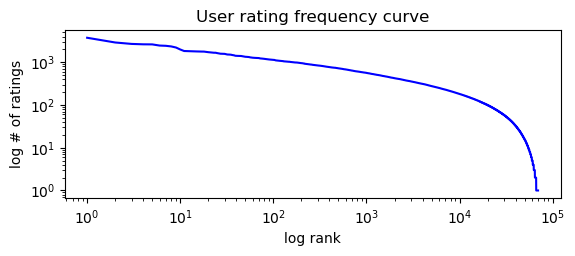

# Samon-Roll
**Sam Cook** 

This project will go through the process of data analysis and processing, model building and training, and finally evaluation. These models are meant to be the foundation for a web app that recommends anime to a user based on either rating information or item features of anime the user has watched. 

## Problem Statement

The purpose of this system will be to recommend new anime that a user might enjoy watching. These recommendations will be based on the anime the user has watched and rated. 

To get these recommendations, the user would interact with a web app that would initially display some top rated anime for the user to pick their favorites from, given that they don't already have an account with their ratings and watched anime stored. These top picks will form a temporary user vector to generate new recommendations for the user until the users profile has enough data to form recommendations from it.

The recommendations can be tested before deployment of the web app by using a train-test split on the data and testing the systems to see how accurate they are. It can also be tested by acting as a new user and choosing different sets of favorite anime from a list of top anime to generate different sets of recommended games. These will have to be evaluated by the "users" judgement to see if they seem like good recommendations based on the choices selected.

## Data Description 

The dataset I chose to use is an anime ratings dataset from <a href='https://www.kaggle.com/datasets/CooperUnion/anime-recommendations-database/data'>kaggle</a>. The data includes over 6 million ratings on about 10,000 different anime from around 70,000 different users.

There are two csv files in this dataset: anime.csv and rating.csv. The file anime.csv contains information on the anime which includes: 
* anime ID 
* title
* genres (each genre that the anime is a part of)
* viewing type (can be movie, TV, etc.)
* number of episodes
* number of members in an anime's "group"

The file rating.csv includes:
* user ID
* anime ID
* rating of the anime by the corresponding user

### Exploratory Data Analysis 

When reviewing the data, I analyzed three different relationships in the data.

First, I checked the distribution of the average ratings of items.

From this, I saw that a majority of the ratings were between 6 and 7.

Next, I analyzed the rank of each item based on the number of ratings it has. I plotted this using a log vs. log scale.

We can see there is a somewhat steep drop off towards the end showing there are some unpopular items that could be excluded from the data.

Lastly, I viewed the frequency of ratings per user. I used a log vs log scale for this as well as there were a few extreme outliers in the data.

We can see it is somewhat similar to the item popularity curve, but seems to start to drop off a little more gradually until later in the rankings where it drops of somewhat drastically.

After analyzing the data, I then filtered out the ratings I deemed unecessary and plotted the graphs again. I excluded items with less than 60 ratings because this was about the cutoff for the 50th percentile of ratings. I also excluded ratings from users who rated more than 250 and less than 40 because these were the boundaries where the data seemed more unpredictable outside of them.

The weighted average distribution seems to show more ratings between 7 and 8 now, so a bit higher than before. The popularity curve appeared to stay pretty much the same. However, the user rating frequency seemed to change much more drastically. The data now has a more consistent frequency of ratings per user.

### Data Preprocessing 

The only dimensionality reduction I did reducing the amount of data by filtering out the unpopular anime and the ratings from users who either rated very few anime or rated an extreme amount. This split the size of the ratings in about half to about 3 million ratings.

For the actual application, I plan on using a small sample of the data to train and retrain the data because it has to be retrained each time a new user joins the system, so the smaller sample of data allows for a faster training time.

The app will also include a search system that will include a content based recommender, so I have included preprocessing for the data needed for that feature. This entailed creating a item feature matrix that used binary values for the genres and the viewing type.

## algorithms

I plan to use a basic recommender using als to reduce the loss function, matrix factorization techniques, a knn model, and a nearest neighbor clustering algotithm. 

The first model will only the baseline to predict the rating. This will use alternating least squares to reduce the loss function and predict the rating. This model will be the basic algorithm to compare the others to. 

I will then use matrix factorization to build a model that uses the user-item matrix to generate the recommendations using basic information about each anime, such as the user's rating for it. This model will use stochastic gradient descent to reduce the loss function. 

The next model uses k-nearest neighbors to predict ratings given the user-rating data. This model will use pearson correlation to determine the similarities of anime along with sgd to reduce the loss function when predicting the ratings.

The last model I will examine will incorporate a clustering algorithm to find similar anime, and make recommendations using a content based filtering model. This model will use more features of the anime to find similarities between them.

***

For my baseline evaluation, I will use the first model listed above. This model will compute baseline ratings using an alternating least squares method, and these ratings will be added to the average rating to compute the predicted rating. I will compare recommendations from this model to each of the other models to help evaluate them.

The methods I am using aside from this model include matrix factorization and clustering algorithms. I chose to use matrix factorization because it is proven to be a good technique to use for recommender systems when given user-rating data. I chose to use both ALS and SGD so that I can examine the benefits of both methods. The reason I am also using clustering algorithms is because I wanted to see if computing similarity scores allowed for a better prediction than just computing the predicted rating without them.

In your report, describe your choice of algorithms and the design of any new algorithmic concepts you develop. Justify these clearly in terms of your application’s needs and the possibilities afforded by the data – I need to know why you think these algorithms might be a good idea, specifically.

## Experiments

To evaluate the models to see which would be best for the application, I would first create a set of data reflecting a new user and choices they made of top anime they enjoyed watching before. For the experiment, I would enter data for myself, and ask a couple of friends to for their choices as well. I would then retrain the models by using a sample of the whole dataset and adding the new user data to it. Then, I would get the top n recommendations for each model and each user would evaluate the recommendations based on whether the user thinks that they would enjoy the anime suggested. We will assume the new data for each new user added is not the entirety of the anime they have previously watched, so there may be anime that are recommended that they have previously seen, which will help suggest that the recommendations made are good. 

Using the same models as before, I retrained each model after adding in 5 ratings from a new user. Then after the new model was trained, I got the top 25 recommendations from each model using a getTopN method that returned the top N recommendations. I then analyzed these recommendations to see if there was anime included that I would enjoy. Based on this observation, there were not many that I knew of or that I thought I would enjoy off of first glance, but I would have to watch the shows/movies to know for sure. Aside from this, I calculated the diversity and novelty scores. The recommendations from each recommender had fairly low diversity scores but high novelty scores.

This tells me that the recommendations are consistent, but also not just the most popular anime from the data. In my opinion, any of these models provide for a solid base for a recommender system.

## Reflection 

Finally, provide a 2-3 paragraph reflection on what you learned through this project and the class. If you have suggestions for future offerings, I welcome those as well.
<Complete for the **Project Submission**>
* What did not work? 
* What do you think why? 
* What were approaches, tuning model parameters you have tried? 
* What features worked well and what didn't? 
* When describing methods that didn't work, make clear how they failed and any evaluation metrics you used to decide so. 
* How was that a data-driven decision? Be consise, all details can be left in .ipynb

Throughout this project and course as a whole, I have learned a lot about recommender systems and furthered my knowledge on data analysis and machine learning concepts. Specifically in this project I learned a lot about the differences between types of recommender systems. Before having to try and deal with the cold-start problem for myself, I thought that I could easily integrate a content based and collaborative filtering model to counter this. However, I was proven wrong pretty quickly because I could not find an efficient way to combine the two. I plan to try and work through this in a personal project I am working on, but for now I will have to deal with the draw back of retraining to incorporate new user data.

On the models I did implement, the approaches were all pretty much the same. The data preprocessing was the same for all three collaborative filtering models since each of them used user-rating data to train. Then for hyperparameter tuning, I used GridSearchCV to iterate over the different combinations of parameters to find the best combination that reduced the RMSE score the most. This wasn't difficult, but it took a great deal of time since there were nearly 6 million ratings used. After training each model, I compared the rmse and calculated the mae of each model to compare. They were all pretty similar but the KNN had slightly better scores in each metric.

To evaluate the recommendations, I added a new user's data using anime that I have watched and enjoyed before so that I could personally judge the recommendations produced. From these recommendations, I also calculated the diversity and novelty scores as another way to measure the systems recommendations. Based on the recommendations generated and their scores, I think that the system could benefit from more data about users other than just their provided ratings. The recommendations were all fairly similar and some didn't seem like I would enjoy them. However, the recommendations were more uncommon anime, which is why each models novelty score was pretty high. This can be seen as a good feature depending on if the user is wanting to find a hidden gem or would rather have a popular anime recommended.

Overall, I really enjoyed learning about and implementing recommender systems. I believe these models could use improvement for a real world implementation, but are a solid foundation to start with.